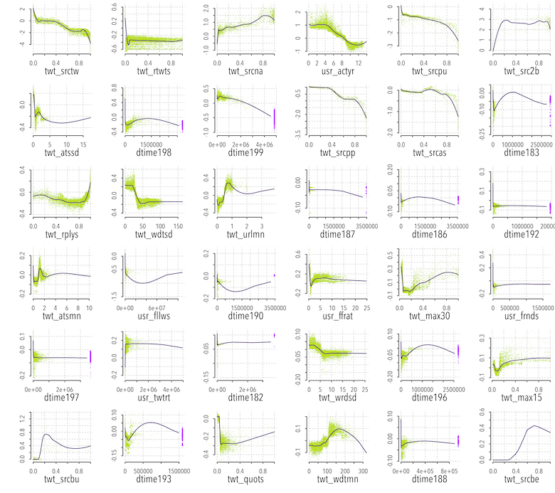

<!-- README.md is generated from README.Rmd. Please edit that file -->

# tweetbotornot2 

<!-- badges: start -->

[](https://travis-ci.org/mkearney/tweetbotornot2)
[](https://CRAN.R-project.org/package=tweetbotornot2)
[](https://www.tidyverse.org/lifecycle/#experimental)
[](https://codecov.io/gh/mkearney/tweetbotornot2?branch=master)
<!-- badges: end -->

{tweetbotornot2} provides an out-of-the-box classifier for detecting
Twitter bots that is easy to use, volume-friendly (classify over two
hundred thousands accounts per day), accurate (see paper), robust and
customizable (update the model with new or user-defined training data),
and explainable (view feature contributions behind each estimated
probability).

## Installation

You can install the released version of tweetbotornot2 from
[CRAN](https://CRAN.R-project.org) with:

``` r
install.packages("tweetbotornot2")
```

## Predict

### Use `predict_bot()` to use the built-in bot classifier

Enter screen names of Twitter users of interest and `predict_bot()`
returns the estimated probability that one or more Twitter accounts is a
bot.

``` r
## pass screen names to predict function
predict_bot(c("MagicRealismBot", "netflix_bot", "rdpeng", "hspter"))
#>       user_id     screen_name  prob_bot
#> 1: 1203840834     netflix_bot 0.9974465
#> 2:   24228154          hspter 0.0049212
#> 3: 3701125272 MagicRealismBot 0.9999903
#> 4:    9308212          rdpeng 0.0171962
```

`predict_bot()` also accepts previously collected Twitter data (e.g.,
data returned by `rtweet::get_timelines()`)

``` r
## estimate bot probabilities
twtdat <- rtweet::get_timelines(
  c(
    ## (these ones should be bots)
    "American__Voter",
    "MagicRealismBot", 
    "mitchhedbot",
    "rstats4ds", 
    "thinkpiecebot", 
    "tidyversetweets", 
    "newstarsbot",
    ## (these ones should be Nots)
    "AOC", 
    "kearneymw", 
    "kumailn", 
    "mindykaling", 
    "NateSilver538", 
    "realDonaldTrump", 
    "hspter",
    "rdpeng"),
  n = 200, check = FALSE)

## view output (order most likely to least like bot)
predict_bot(twtdat)[order(-prob_bot), ]
#>                 user_id     screen_name   prob_bot
#>  1:          3701125272 MagicRealismBot 0.99999034
#>  2:  780707721209188352     newstarsbot 0.99998772
#>  3:  935569091678691328 tidyversetweets 0.99997628
#>  4:  829792389925597184 American__Voter 0.99997509
#>  5:          3325527710   thinkpiecebot 0.99995565
#>  6: 1075011651366199297       rstats4ds 0.99990749
#>  7:           214244836     mitchhedbot 0.99943238
#>  8:          2973406683       kearneymw 0.25081277
#>  9:             9308212          rdpeng 0.01719619
#> 10:            16017475   NateSilver538 0.00575173
#> 11:            24228154          hspter 0.00492118
#> 12:           138203134             AOC 0.00146773
#> 13:            25073877 realDonaldTrump 0.00055846
#> 14:            28406270         kumailn 0.00019779
#> 15:            23544596     mindykaling 0.00015592
```

## Explain

### Use `explain_bot()` to see the contributions made by each feature in the model

Examine prediction contributions for features in the model

``` r
## view top features in predictions of each user
explain_bot(twtdat)[feature %in% feature[1:10], .SD, on = "feature"][1:30, -1]
#>         screen_name  prob_bot   feature     value                feature_description
#>  1:             AOC 0.0014677 twt_srctw -2.323293 Tweet source of Twitter (official)
#>  2:             AOC 0.0014677 usr_verif -1.284003                      User verified
#>  3:             AOC 0.0014677 usr_actyr -1.014036                   User account age
#>  4:             AOC 0.0014677 twt_wrdsd  0.488277         Tweet word count variation
#>  5:             AOC 0.0014677 twt_hshsd -0.483290           Tweet hashtags variation
#>  6:             AOC 0.0014677 twt_wrdmn  0.452638              Tweet word count mean
#>  7:             AOC 0.0014677 usr_fllws -0.445993                     User followers
#>  8:             AOC 0.0014677 twt_srcna -0.430788            Tweet source of unknown
#>  9:             AOC 0.0014677      BIAS  0.428031             Intercept (y when x=0)
#> 10:             AOC 0.0014677 twt_wdtsd -0.389770     Tweet display widht variatiojn
#> 11: American__Voter 0.9999751 twt_srctw  2.432743 Tweet source of Twitter (official)
#> 12: American__Voter 0.9999751 usr_actyr  1.873929                   User account age
#> 13: American__Voter 0.9999751 twt_srcna  0.987790            Tweet source of unknown
#> 14: American__Voter 0.9999751      BIAS  0.428031             Intercept (y when x=0)
#> 15: American__Voter 0.9999751 twt_wdtsd  0.294395     Tweet display widht variatiojn
#> 16: American__Voter 0.9999751 usr_fllws -0.169355                     User followers
#> 17: American__Voter 0.9999751 twt_wrdmn -0.122340              Tweet word count mean
#> 18: American__Voter 0.9999751 twt_hshsd  0.111720           Tweet hashtags variation
#> 19: American__Voter 0.9999751 twt_wrdsd  0.055833         Tweet word count variation
#> 20: American__Voter 0.9999751 usr_verif  0.037031                      User verified
#> 21: MagicRealismBot 0.9999903 twt_srctw  2.309017 Tweet source of Twitter (official)
#> 22: MagicRealismBot 0.9999903 usr_actyr  2.285697                   User account age
#> 23: MagicRealismBot 0.9999903 twt_srcna  0.821680            Tweet source of unknown
#> 24: MagicRealismBot 0.9999903      BIAS  0.428031             Intercept (y when x=0)
#> 25: MagicRealismBot 0.9999903 twt_wrdmn  0.392373              Tweet word count mean
#> 26: MagicRealismBot 0.9999903 usr_fllws -0.353814                     User followers
#> 27: MagicRealismBot 0.9999903 twt_wdtsd  0.337816     Tweet display widht variatiojn
#> 28: MagicRealismBot 0.9999903 twt_hshsd  0.143486           Tweet hashtags variation
#> 29: MagicRealismBot 0.9999903 twt_wrdsd  0.087068         Tweet word count variation
#> 30: MagicRealismBot 0.9999903 usr_verif  0.039289                      User verified
#>         screen_name  prob_bot   feature     value                feature_description
```

## Update

### Use `sample_via_twitter_lists()` to gather new users

`sample_via_twitter_lists()` leverages Twitter lists to snowball sample
from a few users (input) to hundreds or even thousands of users
(output). Use it to find and label “bot” and “not” (bot) Twitter
accounts via snowball sampling

``` r
## find up to 10,000 accounts similar to these well-known Twitter bots
bots <- sample_via_twitter_lists(c("netflix_bot", "American__Voter", "UTLEGtracker", 
  "JVLast", "EndlessJeopardy", "PossumEveryHour", "MagicRealismBot", "factbot1"), 
  n = 10000)

## retrieve user and timeline information for each user
bots_tmls <- tweetbotornot_collect(bots)
```

### Use `preprocess_bot()` to prepare user timeline data for modeling

Extract and transform numeric features from the data

``` r
## wrangle, munge, aggregate data for modelling
bots_tmls <- preprocess_bot(twtdat)
```

### Use `tweetbotornot_update` to train the model on new data

``` r
## train model
new_model <- tweetbotornot_update(newdata)

## use updated model to get new predictions
predict_bot(new_model, c("netflix_bot", "mindykaling"))
```

## About Model

### Feature importance

The most influential features in the classifier


### Feature contributions

How features contributed to predictions in the original training data:


