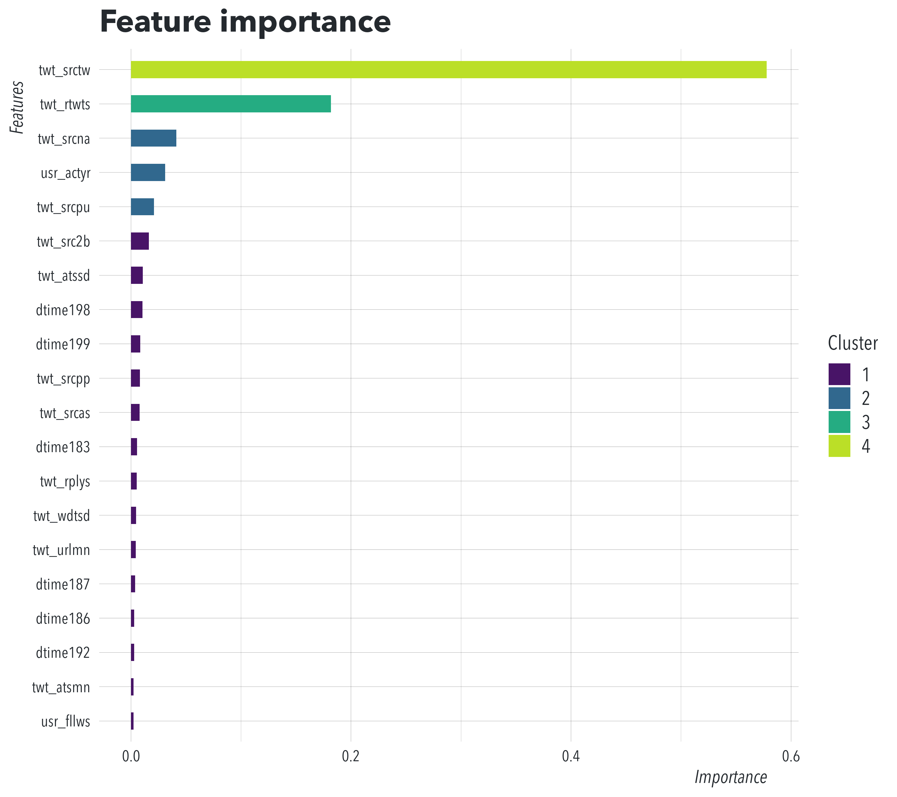

<!-- README.md is generated from README.Rmd. Please edit that file -->

# tweetbotornot2

<!-- badges: start -->

<!-- badges: end -->

{tweetbotornot2} provides an out-of-the-box classifier for detecting
Twitter bots that is easy to use, volume-friendly (classify over two
hundred thousands accounts per day), accurate (see paper), robust and
customizable (update the model with new or user-defined training data),
and explainable (view feature contributions behind each estimated
probability).

## Installation

You can install the released version of tweetbotornot2 from
[CRAN](https://CRAN.R-project.org) with:

``` r
install.packages("tweetbotornot2")
```

## Apply Model

### `tweetbotornot_predict()`: Predicts (apply classifier to) new data

Simply input the names of Twitter users of interest and
`tweetbotornot_predict()` returns the estimated probability that one or
more Twitter accounts is a bot.

``` r
## pass screen names to predict function
tweetbotornot_predict(c("MagicRealismBot", "netflix_bot", "rdpeng", "hspter"))
```

`tweetbotornot_predict()` also accepts previously collected Twitter data
(e.g., data returned by `rtweet::get_timelines()`)

``` r
## estimate bot probabilities
twtdat <- rtweet::get_timelines(
  c(
    ## (these ones should be bots)
    "American__Voter",
    "MagicRealismBot", 
    "mitchhedbot",
    "rstats4ds", 
    "thinkpiecebot", 
    "tidyversetweets", 
    "newstarsbot",
    ## (these ones should be Nots)
    "AOC", 
    "kearneymw", 
    "kumailn", 
    "mindykaling", 
    "NateSilver538", 
    "realDonaldTrump", 
    "hspter",
    "rdpeng"),
  n = 200, check = FALSE)

## view output (order most likely to least like bot)
tweetbotornot_predict(twtdat)[order(-prob_bot), ]
#>                 user_id     screen_name   prob_bot
#>  1:          3701125272 MagicRealismBot 0.99998999
#>  2:  780707721209188352     newstarsbot 0.99998736
#>  3:  935569091678691328 tidyversetweets 0.99997628
#>  4:  829792389925597184 American__Voter 0.99997056
#>  5:          3325527710   thinkpiecebot 0.99996030
#>  6: 1075011651366199297       rstats4ds 0.99983037
#>  7:           214244836     mitchhedbot 0.99942195
#>  8:          2973406683       kearneymw 0.05339408
#>  9:             9308212          rdpeng 0.01719619
#> 10:            16017475   NateSilver538 0.00723628
#> 11:            24228154          hspter 0.00389387
#> 12:            25073877 realDonaldTrump 0.00125679
#> 13:           138203134             AOC 0.00122775
#> 14:            23544596     mindykaling 0.00016858
#> 15:            28406270         kumailn 0.00016037
```

### `tweetbotornot_explain()` Explains the contributions from each feature on the estimated probability

Examine prediction contributions for features in the model

``` r
## view top features in predictions of each user
tweetbotornot_explain(twtdat)[feature %in% feature[1:4], .SD, on = "feature"][1:16, -1]
#>         screen_name  prob_bot   feature     value        feature_description
#>  1:             AOC 0.0012278 twt_srctw -2.349361                       <NA>
#>  2:             AOC 0.0012278 usr_verif -1.288429              User verified
#>  3:             AOC 0.0012278 usr_actyr -0.989596           User account age
#>  4:             AOC 0.0012278 twt_wrdsd  0.467928 Tweet word count variation
#>  5: American__Voter 0.9999706 twt_srctw  2.447532                       <NA>
#>  6: American__Voter 0.9999706 usr_actyr  1.839742           User account age
#>  7: American__Voter 0.9999706 twt_wrdsd  0.052839 Tweet word count variation
#>  8: American__Voter 0.9999706 usr_verif  0.037238              User verified
#>  9: MagicRealismBot 0.9999900 twt_srctw  2.312730                       <NA>
#> 10: MagicRealismBot 0.9999900 usr_actyr  2.304153           User account age
#> 11: MagicRealismBot 0.9999900 twt_wrdsd  0.060281 Tweet word count variation
#> 12: MagicRealismBot 0.9999900 usr_verif  0.039289              User verified
#> 13:   NateSilver538 0.0072363 twt_srctw -2.281533                       <NA>
#> 14:   NateSilver538 0.0072363 usr_actyr -1.107124           User account age
#> 15:   NateSilver538 0.0072363 usr_verif -1.030910              User verified
#> 16:   NateSilver538 0.0072363 twt_wrdsd  0.371479 Tweet word count variation
```

## Update Model

### `tweetbotornot_sample()` Uses Twitter lists to snowball sample from a few users (input) to hundreds or even thousands of users (output)

Find and label “bot” and “not” (bot) Twitter accounts via snowball
sampling

``` r
## find up to 10,000 accounts similar to these well-known Twitter bots
bots <- tweetbotornot_sample(c("netflix_bot", "American__Voter", "UTLEGtracker", 
  "JVLast", "EndlessJeopardy", "PossumEveryHour", "MagicRealismBot", "factbot1"), 
  n = 10000)

## retrieve user and timeline information for each user
bots_tmls <- tweetbotornot_collect(bots)
```

### `tweetbotornot_preprocess()` Prepares timeline data for modeling

Extract and transform numeric features from the data

``` r
## wrangle, munge, aggregate data for modelling
tweetbotornot_preprocess(twtdat)
```

### `tweetbotornot_update()` Resumes model training with new data

Add updated or your own take on bot/not data to further train the
classifier

``` r
## train model
new_model <- tweetbotornot_update(newdata)

## use updated model to get new predictions
tweetbotornot_predict(new_model, c("netflix_bot", "mindykaling"))
```

## About Model

### Feature importance

The most influential features in the classifier



### Feature contributions

How features contributed to predictions in the original training data:


